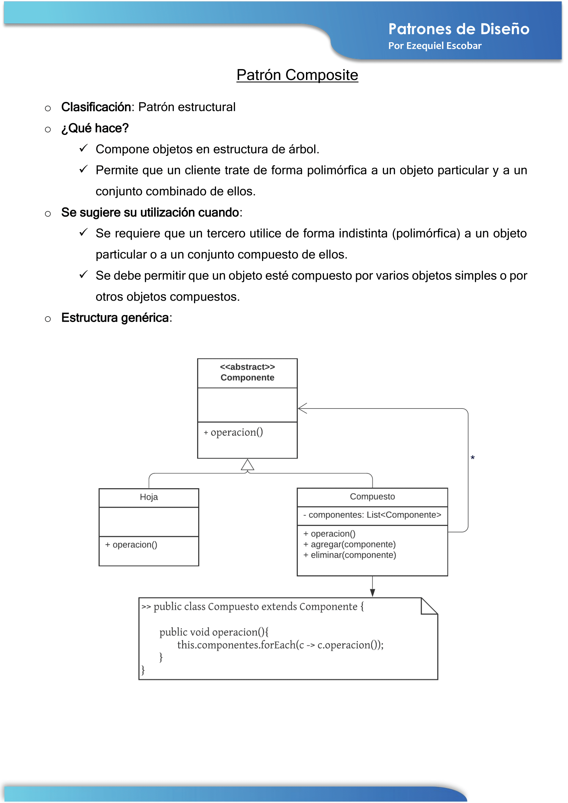
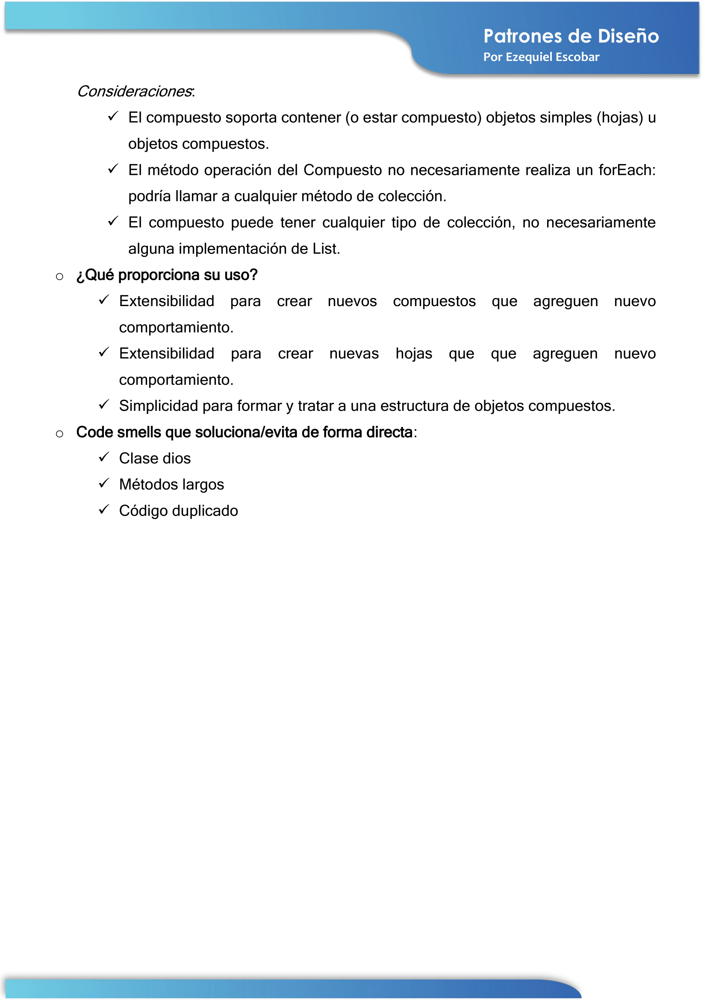

### Contenido del repositorio
En este repositorio te encontrarás con un template básico del Patrón de Diseño Composite implementado en varios lenguajes de programación, a saber:
- **C#**: respetando la utilización de Net Framework 4.7.2
- **Java**: respetando la utilización de la JDK de Java 8
- **PHP**: respetando la sintaxis de la versión 7
- **Python**: respetando la sintaxis de la versión  3.7.2

Además, (más abajo) vas a encontrar una explicación teórica del patrón en cuestión, la cual contiene:
- Clasificación del patrón
- ¿Qué hace?
- ¿Cuándo se sugiere su utilización?
- Estructura genérica (diagrama de clases) con sus consideraciones
- ¿Qué proporciona su uso? Vinculado a las cualidades de diseño y algunos atributos de calidad.
- Code Smells que soluciona/evita de forma directa

